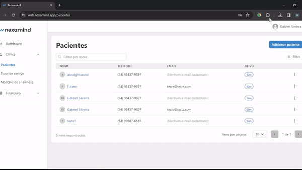

<p align="center">
  
</p>

DevReport Chrome Extension
=========================

DevReport is a Chrome extension that intercepts web requests and generates an HTML report stored in a zip file.

## Features

- Intercept and analyze web requests.
- Generate an execution report in HTML format.
- Lightweight and easy to use.

<p align="center">
  
</p>

## Getting Started

### Prerequisites

- Google Chrome browser

### Installation

1. Download the extension files from the repository:

    ```
    git clone https://github.com/yourusername/devreport-chrome-extension.git
    ```

2. Open Google Chrome and navigate to `chrome://extensions/`.

3. Enable "Developer mode" in the top right corner.

4. Click on "Load unpacked" and select the downloaded extension folder.

5. The DevReport extension will be added to your Chrome browser.

## Usage

1. Click on the DevReport extension icon.

2. Access the tab you want to intercept.

3. Click on "Start Report".

4. Navigate on the tab while requests are being intercepted.

5. Click on "Stop Report".

6. Download and unzip the generated .zip file.

7. Open the .html report file.
## :warning: Attention

Please note that if the files are not extracted in the same directory before opening, the data may not load correctly. Ensure that you unzip the downloaded files within the same repository directory before attempting to open or use the generated reports.

If you encounter any issues or have questions, feel free to open an issue for assistance.


## Contributing
Contributions are welcome! If you have suggestions, bug reports, or want to discuss new features, please open an issue to start a discussion.

For implementing new features or fixing bugs:

1. Fork the repository.

2. Create a new branch from the `develop` branch:

    ```bash
    git checkout -b feature/your-feature-name
    ```

3. Make your changes and ensure the code follows the project's coding standards.

4. Test your changes thoroughly.

5. Commit your changes:

    ```bash
    git commit -m "Add your concise and meaningful commit message"
    ```

6. Push your branch to your fork:

    ```bash
    git push origin feature/your-feature-name
    ```

7. Open a pull request against the `develop` branch, describing your changes and referencing the related issue.

8. Your pull request will be reviewed, and once approved, it will be merged.

Thank you for contributing to DevReport!

## License

This project is licensed under the [MIT License](LICENSE).

## Acknowledgments

- [Google Chrome](https://www.google.com/chrome/)
- [Chrome Developer Tools](https://developer.chrome.com/docs/devtools/)
